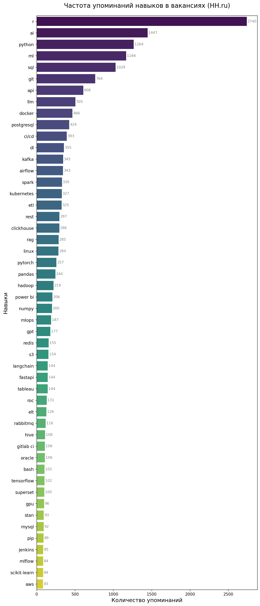

# HH Skill Parser

Этот скрипт собирает вакансии с сайта [HH.ru](https://hh.ru) по ключевым запросам (например, "DataScience", "ML Engineer"), извлекает из них **технические навыки**, и строит столбчатую диаграмму самых популярных навыков.

## Особенности

- Использует API HH.ru для получения вакансий.
- Фильтрация по whitelist навыков.
- Построение графика с помощью `matplotlib` и `seaborn`.
- Сохранение графика в формате PNG.

## Установка

1. Клонируйте репозиторий:

   ```bash
   git clone https://github.com/valeksan/hh-skills-parser.git
   cd hh-skills-parser
   ```

2. Создайте виртуальное окружение и активируйте его:
   ```bash
   python -m venv .venv
   source .venv/bin/activate  # Linux/Mac
   # или
   .venv\Scripts\activate     # Windows
   ```

3. Установите зависимости:
    ```bash
    pip install -r requirements.txt
    ```

## Использование

Запустите скрипт:
   ```bash
   python parse_skills.py
   ```

Результат будет сохранён в файл `hh_skills_bar_chart.png`.
Можно добавить свои навыки в `skills_whitelist.txt`.

## Зависимости

- requests
- beautifulsoup4
- matplotlib
- seaborn
- pandas
- numpy

## Результат (пример графика навыков)

График показывает самые популярные навыки, извлечённые из вакансий:



## License

This project is licensed under the MIT License - see the [LICENSE](LICENSE) file for details.
