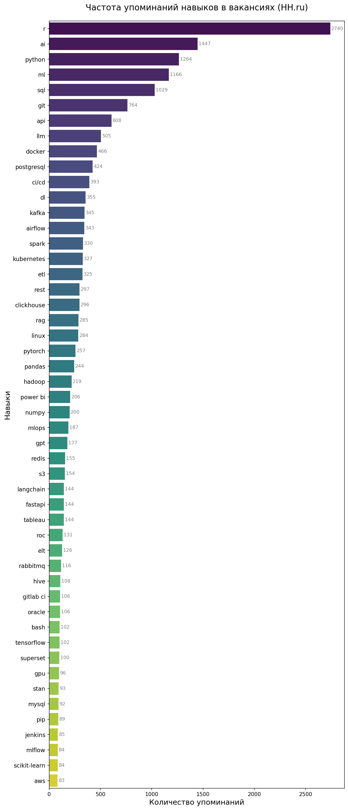

# HH Skill Parser

Этот скрипт собирает вакансии с сайта [HH.ru](https://hh.ru) по ключевым запросам (например, "DataScience", "ML Engineer"), извлекает из них **технические навыки**, и строит столбчатую диаграмму самых популярных навыков.

## Особенности

- Использует API HH.ru для получения вакансий.
- Фильтрация по whitelist навыков.
- Поддержка **сохранения прогресса** — если скрипт прервётся, при перезапуске он продолжит с места остановки.
- Построение графика с помощью `matplotlib` и `seaborn`.
- Сохранение графика в формате PNG и CSV-файл с полным списком навыков для анализа.

## Установка

1. Клонируйте репозиторий:

   ```bash
   git clone --depth=1 https://github.com/valeksan/hh-skills-parser.git
   cd hh-skills-parser
   ```

2. Создайте виртуальное окружение и активируйте его:
   ```bash
   python -m venv .venv
   source .venv/bin/activate  # Linux/Mac
   # или
   .venv\Scripts\activate     # Windows
   ```

3. Установите зависимости:
    ```bash
    pip install -r requirements.txt
    ```

## Использование

1. **Настройка**. Измените файлы:
- `queries.txt` — список ключевых запросов для поиска вакансий.
- `skills_whitelist.txt` — список навыков для анализа. (не обязательно)

2. **Запуск**
   ```bash
   # Стандарный способ
   python parse_skills.py
   # На UNIX
   ./parse_skills.py
   
   # Для получения справки
   ./parse_skills.py --help
   ```
___
3. **Результат** будет сохранён в файл `hh_skills_bar_chart.png`.

## Environment variables

### LOGLEVEL
Приниает одно из значений `warning`,`error`,`critical`,`info`,`debug`.
По умолчинию `LOGLEVEL`=`warning`

Пример использования:
```bash
LOGLEVEL=info ./parse_skills.py
```

## Формат файлов

### queries.txt
Список поисковых запросов (по одному на строку). Строки, начинающиеся с #, игнорируются.
Пример:
```txt
# Вакансии Data Science
Data Scientist
Machine Learning
ML Engineer
```

### skills_whitelist.txt
Список навыков для анализа (по одному на строку). Строки, начинающиеся с #, игнорируются.
Пример:
```txt
python
sql
pandas
...
```

## Описание логики работы
Поиск проводиться по строгому совпадению запроса из `queries.txt` в названии вакансии.

При `--mode key-skills` происходит поиск по навыкам указанным в вакансии hh.ru. Объясняя 
другими словами это навыки, которые можно подтвердить в резюме.

При `--mode desctiption` поиск будет выполнен в описании вакансии. Возможны ложные срабатывания, 
т.к. анализируется текст без ИИ анализа. Могут встречатся ошибки по типу: `c` это ЯП, но проблема в 
том, что теоретически возможны ошибки кодировки и спутать с кириллической `с`.

## Результаты

- График: `hh_skills_bar_chart.png`
- Полный список навыков: `top_skills_all_data.csv`
- Прогресс: `progress.json`

График показывает самые популярные навыки, извлечённые из вакансий



## License

This project is licensed under the MIT License - see the [LICENSE](LICENSE) file for details.

## Автор

[Виталий (@valeksan)](https://github.com/valeksan)
