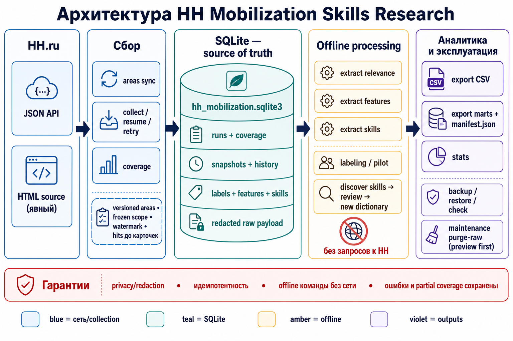

# Исследование навыков по вакансиям HH

Сбор и анализ вакансий, связанных с мобилизационной подготовкой, воинским
учётом, бронированием, ГО/ЧС и режимно-секретной работой.

Основной процесс CLI-пакета `hh-skill-parser`: публичный JSON API HH.ru →
SQLite → офлайн-обработка → экспорт. SQLite — источник истины.

## Архитектура



Сеть нужна только для `areas sync`, `collect`, `resume` и `retry`. Все
извлечения, проверка результатов, экспорт, статистика и обслуживание БД работают
из SQLite.

## Установка

```bash
python -m venv .venv
source .venv/bin/activate
pip install -e .
```

Для детерминированной локальной проверки без сети:

```bash
python -m unittest discover -s tests -p 'test_*.py'
# Та же команда через Makefile:
make test
```

## Запуск

```bash
# Сначала сохранить версионируемый каталог регионов.
hh-skill-parser areas sync

# Новая коллекция с SQLite. --area можно повторять.
# Первый инкрементальный интервал задаёт нижнюю границу; без него собираются вакансии только за текущий день.
# Следующие запуски используют совместимую контрольную дату с перекрытием в один день.
hh-skill-parser collect --area 1 --area 2 --area 13 --area 7 --date-from 2026-01-01

# Либо использовать проверяемый файл HH area ID.
hh-skill-parser areas validate --areas-file areas.txt
hh-skill-parser collect --areas-file areas.txt

# HTML — отдельный явно выбранный источник, без автоматического перехода от API к HTML.
# Каталог областей предварительно синхронизируется через API.
hh-skill-parser collect --source html --area 1 --date-from 2026-01-01

# Исходные ответы не сохраняются по умолчанию. Включайте их только для отладки.
hh-skill-parser collect --source html --store-raw --area 1 --date-from 2026-01-01

# Продолжение того же запуска после сбоя.
hh-skill-parser resume --run-id RUN_ID

# `full` — отдельный исторический интервал; старые snapshots не удаляет.
hh-skill-parser collect --collection-mode full --area 1 --date-from 2025-01-01 --date-to 2025-12-31

# Производные данные строятся отдельно, только из SQLite, без запросов к HH.
hh-skill-parser extract relevance
hh-skill-parser extract --snapshot all features
hh-skill-parser extract --skills-file skills_whitelist.txt skills

# Аналитический CSV только из SQLite. Сеть/extract не запускаются.
hh-skill-parser export vacancies --output vacancies.csv --snapshot latest --relevance relevant
hh-skill-parser export skills --output vacancy_skills.csv
hh-skill-parser export marts --output-dir marts --relevance relevant

# ANA-1: фиксированная выборка из 100 строк, затем вручную заполнить labels и импортировать CSV.
hh-skill-parser pilot create --batch-id 2026-07-30-v1 --output pilot.csv
hh-skill-parser import labeling pilot.csv
hh-skill-parser pilot report --batch-id 2026-07-30-v1 --output pilot-report.json

# Счётчики JSON по той же офлайн-выборке.
hh-skill-parser stats --snapshot latest --query-family military
```

Идентификатор запуска и счётчики печатаются в JSON. Область, страницы, найденные
вакансии, snapshots и ошибки сохраняются в SQLite; повторный запуск не требует
удаления progress-файлов. Watermark продвигается только после полного успешного
инкрементального запуска; degraded run оставляет его прежним. `full` не очищает
history и не меняет incremental watermark.
`extract` по умолчанию обрабатывает latest snapshot каждой вакансии. Фильтры
`--run-id`, `--area`, `--source`, `--date-from/--date-to` ограничивают выборку.
Автоматическая разметка, расчёт признаков и извлечение навыков не выполняются при `collect`/`resume`.
`export vacancies` поддерживает `--run-id`, `--area`, `--relevance`,
`--query-family`, `--date-from/--date-to`; multivalue fields сохранены JSON-строками.
`stats` использует те же фильтры, возвращает counts по relevance/source без сети.
`pilot create` фиксирует выбранные snapshot IDs, filters и query specs в SQLite;
`pilot report` пересчитывает union precision/recall-in-pilot, overlap и marginal gain
только по сохранённому batch и manual labels. `unknown`/blank не входят в binary metrics.
HTML anti-bot/interstitial страница сохраняется как ошибка run, не как вакансия.

## Первый запуск, возобновление и coverage

`areas sync` требует сети и создаёт versioned catalog. После этого выберите
explicit IDs либо catalog selection; collect сохраняет query specs, areas и
catalog version в run. Первый `incremental` использует `--date-from` как нижнюю
границу (либо только today); успешный run двигает watermark. Повторный
incremental читает compatible watermark с overlap. `full` требует обе даты,
историю не удаляет и watermark не меняет.

Если процесс оборвался, не запускайте новый collect для того же scope:

```bash
hh-skill-parser resume --run-id 42
hh-skill-parser coverage --run-id 42
hh-skill-parser retry --run-id 42 --max-attempts 3
hh-skill-parser coverage --run-id 42
```

Чтобы найти ID прерванного запуска без прямого обращения к SQLite:

```bash
hh-skill-parser runs --status running
```

`coverage` читает сохранённые единицы поиска и загрузки карточек, сеть не
вызывает. `completed` означает обработанные единицы, не полноту всех результатов
HH: API pagination ограничена `--max-pages`, насыщенные интервалы режутся до
`--date-slice-min-days`, а failed/saturated/missing cards остаются видимыми в
coverage и errors. `degraded`/partial run нельзя считать полным корпусом.

## Правовые риски и ограничения использования данных

Этот проект предназначен для внутреннего исследовательского и аналитического
использования. Он не предоставляет разрешения на сбор, передачу, публикацию или
коммерческое использование данных HH.ru. Этот раздел не является юридической
консультацией: перед запуском публичного или коммерческого сервиса получите
письменное разрешение правообладателя и заключение юриста по вашей модели работы.

Не публикуйте открыто SQLite-базу, резервные копии, raw HTML/JSON, полные тексты
вакансий, массовые выгрузки карточек, контакты или точные адреса. Даже если
информация была доступна на странице HH.ru, её повторное распространение и
массовое извлечение могут требовать отдельного правового основания и разрешения
правообладателя. В частности:

- изготовитель базы данных обладает исключительным правом на извлечение и
  последующее использование существенной части материалов базы: [статья 1334
  ГК РФ](https://www.consultant.ru/document/cons_doc_LAW_64629/c8b26358cbae2a98f328bd8cb495a08f7e11caff/);
- ФИО, телефон, email и иные сведения о физическом лице могут быть персональными
  данными. Для их распространения действуют специальные требования, а субъект
  вправе потребовать прекратить распространение: [статья 10.1 Федерального
  закона № 152-ФЗ](https://www.consultant.ru/document/cons_doc_LAW_61801/591acc70f577873c1ee54765eda110b7a0271eaf/);
- оператор, собирающий персональные данные через сайт, обязан обеспечить меры
  защиты и доступность политики обработки персональных данных: [статья 18.1
  Федерального закона № 152-ФЗ](https://www.consultant.ru/document/cons_doc_LAW_61801/eeeebe22bf738fd65bb66b95cc278911ae2525ee/).

Для публичного сайта безопаснее ограничиться агрегированной обезличенной
аналитикой: статистикой навыков, периодов, регионов и зарплатных диапазонов, с
датой обновления и ссылкой на исходную вакансию. Не показывайте полный текст,
контактные данные и не позволяйте скачивать сырые данные. Соблюдайте также
[условия использования HH.ru](https://hh.ru/article/33121), настройте ограничение
доступа к БД, сроки хранения и процесс удаления данных по обращениям.

## Офлайн-переобработка и ручная проверка

Все эти команды читают SQLite, не меняют collection counters/status и не ходят
в HH. После изменения extractor, dictionary или ручных labels можно безопасно
повторить их на том же наборе данных:

```bash
hh-skill-parser extract relevance
hh-skill-parser extract --snapshot all features
hh-skill-parser extract --skills-file skills_whitelist.txt skills

# Ручная проверка релевантности.
hh-skill-parser export labeling --output labels.csv --sample-size 100 --sample-seed 20260730
# Заполните только поддерживаемые колонки label/reason, затем:
hh-skill-parser import labeling labels.csv

# Фиксированная выборка: выборка и filters сохраняются в SQLite; report воспроизводим.
hh-skill-parser pilot create --batch-id 2026-07-30-v1 --output pilot.csv
hh-skill-parser import labeling pilot.csv
hh-skill-parser pilot report --batch-id 2026-07-30-v1 --output pilot-report.json
```

Поиск новых навыков начинается с ручной проверки: команда экспортирует evidence
и никогда не меняет текущий dictionary. Решения `approve|reject|merge` создают
только новый dictionary.

```bash
hh-skill-parser discover skills --batch-id review-2026-07 --output skill_candidates.csv
hh-skill-parser import skill-candidates skill_candidates.csv \
  --skills-file skills_whitelist.txt --output skills_whitelist.v2.txt --batch-id review-2026-07
hh-skill-parser extract --skills-file skills_whitelist.v2.txt skills
```

## DA-витрины, manifest и словарь данных

`export marts` создаёт набор CSV только из SQLite. `manifest.json` фиксирует
время генерации, путь к БД, migrations, filters, contributing runs/config hashes,
dictionary versions, row counts и SHA-256 каждого output. Сохраняйте manifest
вместе с отчётом; повторяйте export с теми же filters для сравнения.

```bash
# Relevant latest snapshots для одного запуска, региона и query family.
hh-skill-parser export marts --output-dir marts-42 --run-id 42 --area 1 \
  --relevance relevant --query-family military

# Примеры SQL-запросов к SQLite DB.
sqlite3 hh_mobilization.sqlite3 \
  "SELECT publication_day, vacancy_count FROM publication_time_series ORDER BY publication_day;"
sqlite3 hh_mobilization.sqlite3 \
  "SELECT q.query_group, COUNT(DISTINCT h.vacancy_hh_id) AS hits FROM vacancy_query_hits h JOIN search_queries q ON q.id=h.query_id GROUP BY q.query_group ORDER BY hits DESC;"
```

| Объект | Назначение |
| --- | --- |
| `collection_runs` | Зафиксированный scope сбора, status, counters и config hash. |
| `vacancy_query_hits` | Попадание поиска до загрузки карточки; evidence для recall/coverage. |
| `vacancy_snapshots` | Redacted normalized versions вакансии; latest view выбирает текущую. |
| `effective_relevance_labels` | Manual label при наличии, иначе automatic label. |
| `vacancy_skills` / `vacancy_skill_matrix` | Evidence dictionary/extractor для нормализованных skills. |
| `vacancy_history`, `repost_groups` | Наблюдаемые edits, archive state, potential repost grouping. |
| Reporting views / marts CSV | Производные reporting datasets, не collection source. |

Marts включают динамику публикаций, географию, работодателей, отрасли, темы и
skills, совместную встречаемость skills, зарплаты, занятость, edits, reposts,
пропуски данных, query noise и сохранённые coverage errors.
`top_skills_rf.csv` в наборе marts — SQLite-derived compatibility export.

Регулярный запуск: incremental ежедневно/по расписанию внешним scheduler; full —
отдельно, периодически, с явным historical range. Встроенного scheduler нет:

```bash
hh-skill-parser collect --area 1 --area 2 --date-from 2026-01-01
hh-skill-parser collect --collection-mode full --area 1 --date-from 2026-01-01 --date-to 2026-06-30
```

## Конфигурация CLI с SQLite

Скопируйте `config.example.toml` в `config.toml`. Реальный token в example не
хранится. Приоритет настроек: явный CLI argument → environment → TOML → built-in
default. `HH_ACCESS_TOKEN` перекрывает `[hh].access_token`; token редактируется
перед записью run config и не попадает в SQLite, JSON output или errors.

```bash
cp config.example.toml config.toml
hh-skill-parser collect --config config.toml --areas-file areas.txt
```

`areas.txt` содержит ровно один HH area ID на строку. Пустые строки, строки с
`#` и inline comment разрешены. Пример — `areas.example.txt`. Перед первым
сбором каталог должен быть сохранён через `areas sync`; collection фиксирует
его version в run и `resume` не обновляет scope.

## OAuth HH без ручных HTTP-запросов

Зарегистрируйте приложение на `dev.hh.ru`, добавьте redirect URI
`http://127.0.0.1:8765/callback` и получите `client_id`. Команда открывает
браузер, ждёт callback на localhost, использует PKCE и сохраняет access/refresh
tokens в файл с правами `0600`; token и client secret не печатаются. При запросе
секрета введите `client_secret` приложения. Альтернатива — временно задать
`HH_CLIENT_SECRET` в environment.

```bash
hh-skill-parser auth login --client-id YOUR_CLIENT_ID

# Проверить один реальный запрос, не меняя SQLite.
hh-skill-parser smoke live --confirm-live --token-file .hh_oauth_token.json

# Использовать token file при collection/resume/retry.
hh-skill-parser collect --token-file .hh_oauth_token.json --area 1 --date-from 2026-07-30

# После истечения access token обновить file; refresh token не выводится.
hh-skill-parser auth refresh --client-id YOUR_CLIENT_ID
```

По умолчанию token file — `.hh_oauth_token.json`; он ignored by git. Для другого
пути передайте одинаковый `--token-file` всем этим командам. Не сочетайте его с
`--access-token` или `HH_ACCESS_TOKEN`.

## Очистка raw payload

Сканированные snapshots, hits, labels, features и exports команда не удаляет.
Отдельная maintenance-команда удаляет только compressed raw BLOB старше границы.
Первый вызов всегда preview:

```bash
hh-skill-parser maintenance --database hh_mobilization.sqlite3 purge-raw --before 2025-01-01

# Необратимо удалить только показанные raw BLOB.
hh-skill-parser maintenance --database hh_mobilization.sqlite3 purge-raw --before 2025-01-01 \
  --execute --confirm PURGE_RAW_PAYLOADS
```

Проверка одного уже redacted raw payload не печатает BLOB в терминал или export:

```bash
hh-skill-parser maintenance --database hh_mobilization.sqlite3 inspect-raw \
  --snapshot-id 42 --output snapshot-42.raw
```

Рост raw оценивается до purge через preview (`raw_bytes`) или локально:

```bash
sqlite3 hh_mobilization.sqlite3 'SELECT COUNT(*), COALESCE(SUM(raw_size), 0) FROM vacancy_snapshots WHERE raw_payload IS NOT NULL;'
```

## Резервное копирование и восстановление

Резервное копирование выполняет контрольную точку WAL, согласованное копирование
SQLite и `integrity_check`. Резервное копирование и восстановление не
перезаписывают файл по умолчанию. Восстановление всегда идёт в отдельный
путь и проверяется до/после копирования:

```bash
hh-skill-parser db --database hh_mobilization.sqlite3 backup --output backups/hh-2026-07-30.sqlite3
hh-skill-parser db restore --input backups/hh-2026-07-30.sqlite3 --output restored/hh.sqlite3
hh-skill-parser db --database restored/hh.sqlite3 check
```

`--overwrite` у `db restore` заменяет уже существующий restore output; исходный
backup не меняется.

## Проверочный сетевой запрос

Обычный test suite не вызывает HH. Только явный opt-in smoke делает один API
search (`per_page=1`), timeout максимум 10 секунд, retries выключены, SQLite не
меняется. JSON содержит `completed` либо `degraded/partial`, без token:

```bash
hh-skill-parser smoke live --confirm-live --area 1 --request-timeout 5
```

## Полный новый скан

Обычный `collect` никогда не очищает прошлые результаты. Для полного старта с
чистой DB используйте отдельную команду. Без `--yes` она только покажет таблицы
и число строк:

```bash
hh-skill-parser db --database hh_mobilization.sqlite3 reset

# Необратимо очистить collected/derived data. Schema и migrations сохранятся.
hh-skill-parser db --database hh_mobilization.sqlite3 reset --yes

# Проверить SQLite без изменения data.
hh-skill-parser db --database hh_mobilization.sqlite3 check
```

## Входные файлы

### `query_specs.toml`

Сборщик, работающий через SQLite, использует версионируемые спецификации
поисковых запросов. Каждый запрос сохраняет выражение HH без изменений и явно
выбирает поле `name`, `description` или оба поля. Поэтому точные запросы по
названиям должностей и широкий тематический корпус остаются разделёнными, без
принудительных внешних кавычек.

```toml
version = "2026-07-30"

[[query]]
id = "strong-mobilization"
group = "strong_markers"
expression = "мобилизац*"
search_fields = ["name", "description"]
purpose = "broad corpus"
```

Текущий набор разделён на три контура:

- прямые мобилизационные и военно-учётные роли;
- гражданская оборона и чрезвычайные ситуации;
- первый отдел и режимно-секретная работа.

Изменение `query_specs.toml` относится только к новому run; существующий run сохраняет
свой frozen scope и возобновляется через `resume --run-id`.

### `skills_whitelist.txt`

Содержит навыки, извлекаемые из описаний вакансий. Поддерживает alias-группы:

```text
воинский учет | военный учет | ведение воинского учета
```

Первый элемент — каноническое название в итоговом CSV. Все варианты после `|` считаются тем же навыком; в одной вакансии он учитывается один раз. Одиночные строки также допустимы.

Псевдоним объединяет только варианты одного навыка. Смежные сущности, например воинский учёт и бронирование, остаются разными строками статистики.

## Результаты

- `hh_mobilization.sqlite3` — основной источник данных для сбора через SQLite;
- `marts/` — воспроизводимый набор аналитических витрин с `manifest.json`;
- `marts/top_skills_rf.csv` — совместимый экспорт навыков, сформированный из SQLite.

## Фильтрация

Сборщик, работающий через SQLite, сохраняет каждое попадание поиска до загрузки
карточки и не отклоняет вакансию только по названию. Релевантность, признаки и
навыки вычисляются отдельными офлайн-командами.

## Сеть и ограничения HH

Сборщик, работающий через SQLite, использует публичный JSON API
`https://api.hh.ru`, один `HH-User-Agent`, необязательный токен Bearer, gzip и
ограниченное число повторов временных ошибок. После одной ошибки авторизации
недействительный токен отключается, а запуск продолжается без аутентификации.

Сорок запросов по десяти зонам — длительный сбор. Для продолжения используйте
`hh-skill-parser resume --run-id RUN_ID`.

## Лицензия

MIT. См. [LICENSE](LICENSE).
